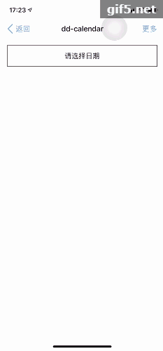

## Welcome to dd-vue-calendar
dd-vue-calendar是一个干净的轻量级移动端日历插件，用于在Vue.js中显示带农历的日历。包括高亮显示的日期区域、节假日、今天、单选日期、多选日期段等。

## dd-vue-calendar 有哪些功能
* 日历展示、节假日、农历、今天
* 单选日期
* 多选日期段

## Install
```
npm install dd-vue-calendar --save
```

## Import
新建 ddVueCalendar.js
```
import Vue from "vue"
import ddVueCalendar from "dd-vue-calendar"
import "dd-vue-calendar/lib/calendar.css"
Vue.use(ddVueCalendar)
```
并在 main.js 中 import
```
import "./ddVueCalendar目录/ddVueCalendar.js";
```

## Use
在需要使用的组件内直接是用calendar标签
```
<template>
	<calendar class="" v-on:change="calendarChange" :multiple="false"></calendar>
</template>
```

## Attributes
* multiple：true | false，default = false，是否多选
* change：function，选择后的回调函数，参数(p, values, displayValues)
	* p：Calendar数据
    * values：时间戳
	* displayValues：转换后的时间，年-月-日

## Calendar show
